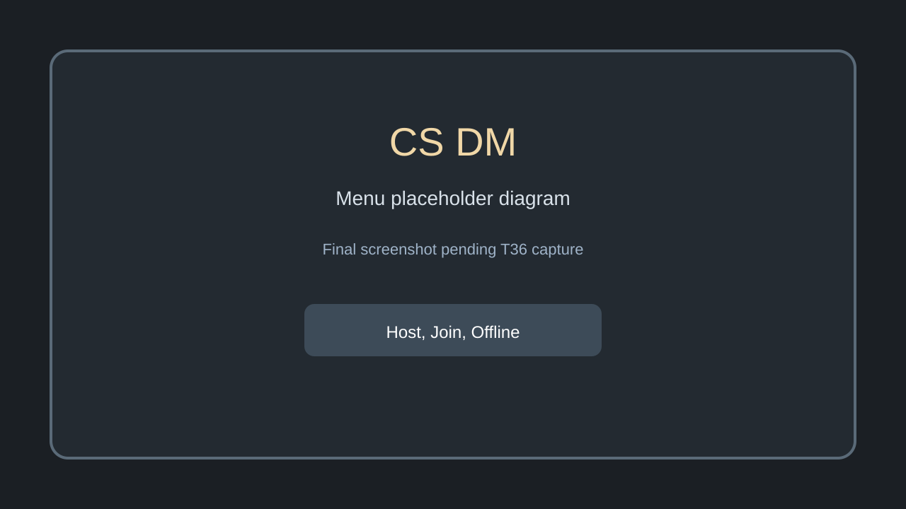
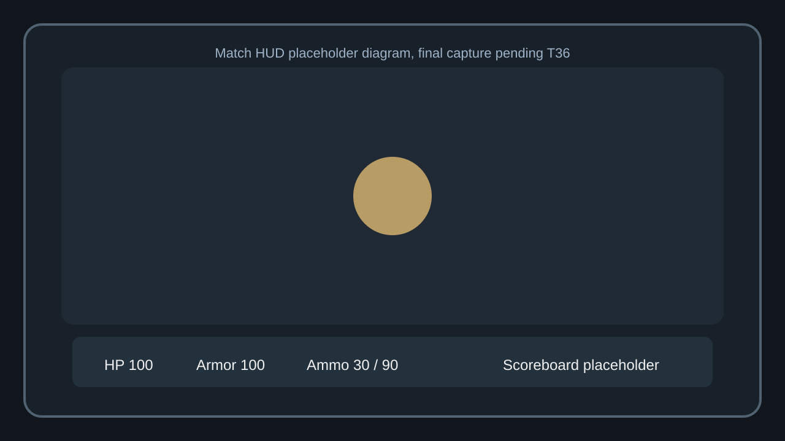

# CS DM

Static GitHub Pages deathmatch prototype for CS DM.

## Overview

CS DM is a static, build-free Three.js deathmatch prototype for GitHub Pages. It keeps the original site structure, uses relative paths only, and ships with offline bots as the reliable baseline.

## Controls

- `WASD` move
- `Mouse` look
- `Mouse1` fire
- `R` reload
- `B` open buy menu
- `Tab` scoreboard
- `Escape` settings or close overlays

## Run and Test

Run from the repository root:

```sh
npm run test
```

To serve the site locally from the repo root:

```sh
python -m http.server 8080
```

## Browser Support

- Desktop Chromium, Firefox, and Safari-class modern browsers
- Pointer lock and WebRTC support are required for the full experience
- Mobile and touch are out of scope for this prototype

## Screenshots

These are placeholder diagrams for now. Final gameplay captures will replace them in T36.





## Manual P2P

1. The host clicks the host flow and generates an offer code.
2. The joiner pastes that offer code, then generates an answer code.
3. The host pastes the answer code to accept the connection.

This is best-effort manual WebRTC and copy paste only. There is no third-party relay, TURN server, signaling broker, backend, or matchmaking service. It is best-effort and depends on browser, NAT, and firewall behavior. If a code is malformed, a room is full, the connection times out, a peer disconnects, the host closes, or versions mismatch, the UI shows a recoverable error and offline bots stay available as the fallback.

## IP and Asset Note

CS DM is not affiliated with Valve, Counter-Strike, or Steam. It does not ship copied Counter-Strike assets, audio, sprites, screenshots, maps, or exported meshes. Visuals here are original or generated placeholders only.

## Known Limitations

- P2P is best-effort and can fail behind some NAT or firewall setups. Offline bots remain the reliable fallback.
- Offline bots are the reliable fallback.
- Final screenshot captures are still pending and the current images are labeled placeholder diagrams.
