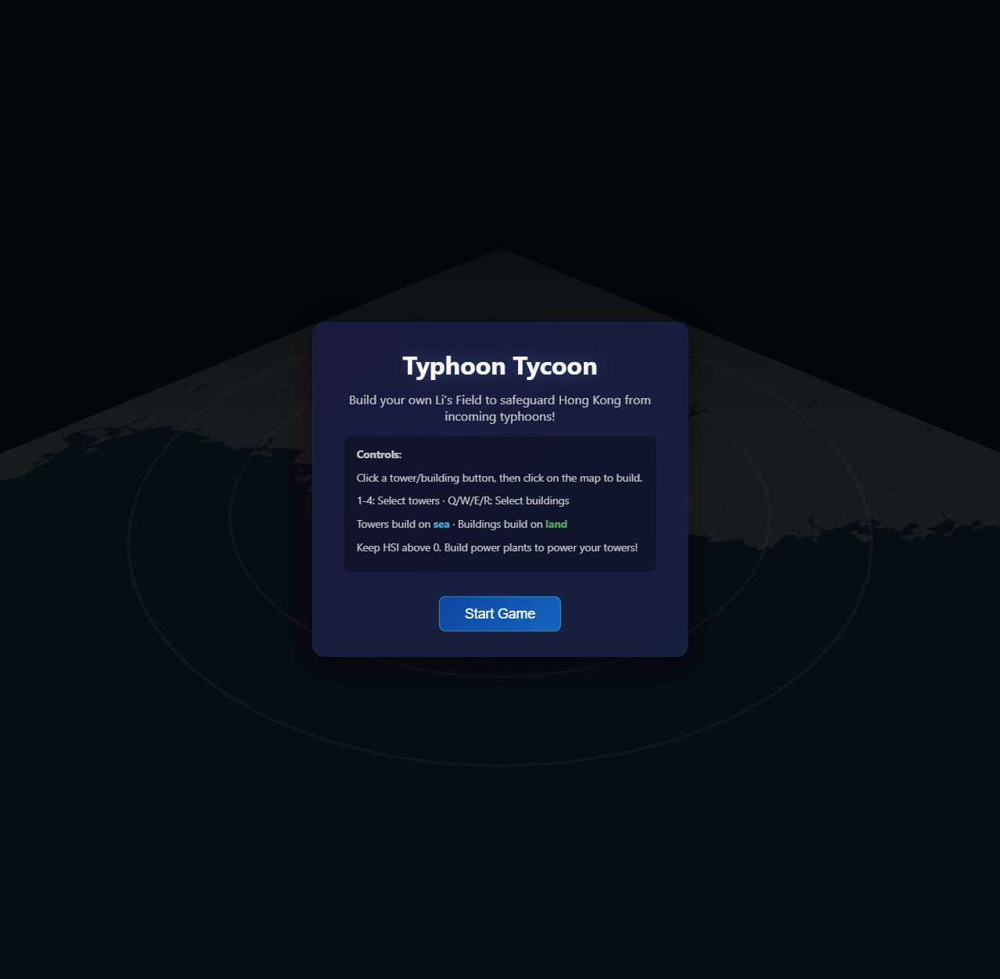
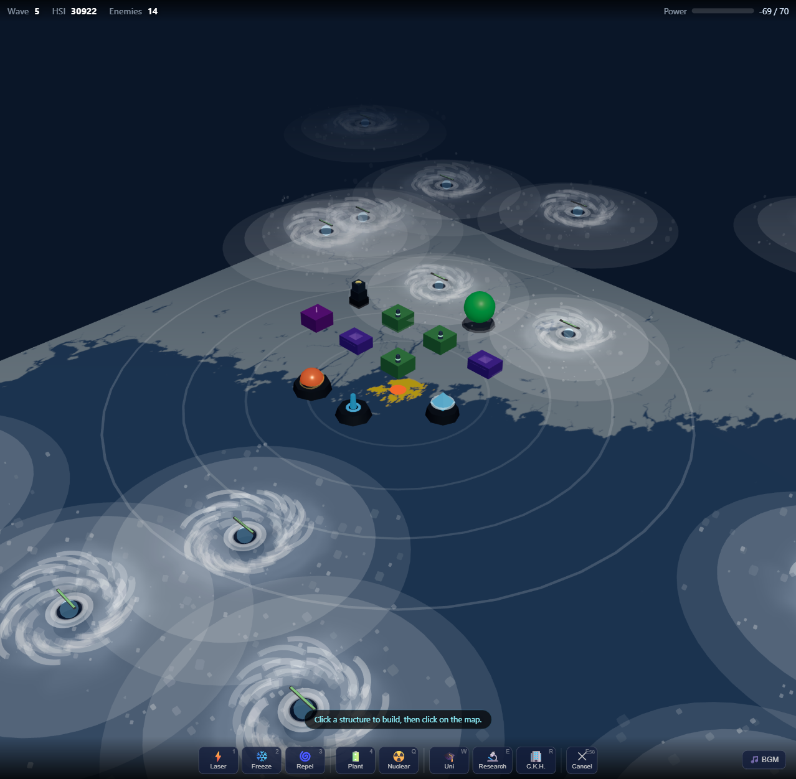

# Typhoon Tycoon — 2.5D Tower Defense

A 2.5D browser-based tower defense game rebuilt in Three.js, inspired by the original [Typhoon Tycoon](https://github.com/jasonycw/TyphoonTycoon).

**Play online:** https://jasonycw.github.io/games/typhoon-tycoon/

## Screenshots


*Start screen with the Hong Kong / South China Sea map and concentric danger zone rings.*


*All 8 structure types deployed (Laser/Freeze/Repel Towers, Power/University/Research/Nuclear Plants, CheungKong HQ) defending against realistic 3D typhoons with dark calm eyes, bright eyewalls, asymmetric spiral rainbands, and multi-layer particle systems.*

## Visual Features

### Realistic 3D Typhoons
Each typhoon is a **full 3D Group** modeled after real tropical cyclone satellite imagery:

- **Dark calm eye** — A deep blue/navy circle at the center, replicating the clear eye visible from space
- **Bright eyewall** — Two concentric rings of dense white convection surrounding the eye, where the most violent winds churn
- **Asymmetric spiral rainbands** — 4 logarithmically-curved arms with varying segment counts and opacities, creating a natural lopsided spiral (real typhoons are never perfectly symmetric)
- **Cloud canopy** — Two layers of semi-transparent ring decks providing the broad diffuse cloud mass
- **Satellite texture overlay** — The original `typhoon.png` rendered as a horizontal plane with additive blending for atmospheric depth
- **Particle system (72 total)** — Three distinct particle types:
  - *Wind streaks* (32) — fast-tangential flow at mid-radii
  - *Cloud wisps* (18) — large slow outer-edge particles with radial oscillation
  - *Rain curtain* (22) — small fast blue-tinted particles bobbing below the cloud deck

The storm spins **counterclockwise** (Northern Hemisphere) with **differential rotation**: inner core particles orbit faster than outer wisps. The core glow pulses with storm intensity, and all elements scale and fade with HP loss — a dying typhoon visibly shrinks and dims.

### Environmental Destruction
Typhoons destroy decorative scenery (skyscrapers and trees) on contact, leaving particle debris bursts. The contact radius scales with typhoon size (HP), so larger storms clear wider paths of destruction.

### Curved Trajectories
Each typhoon follows a **sinusoidal wobble path** instead of a straight line toward center. The wobble amplitude is randomized per enemy and decays as it approaches the island, creating natural-looking spiral approaches like real storm tracks.

### Attack VFX
- **Laser Towers** fire instant beams from the turret barrel to the typhoon body, followed by a particle burst at the impact point
- All projectile types leave **fading particle trails**
- Hit effects use **multi-particle bursts** (flying outward with gravity) instead of single expanding spheres
- Kill explosions release a 12-particle burst

## Background

In the year 21XX, the Li's field (李氏力場) becomes reality in the form of a tower defense system. The system seeks to weaken, if not totally destroy, incoming typhoons into Hong Kong. Li's enterprise has appointed you to control the typhoon defence system. Defend Hong Kong from incoming typhoons by building towers and managing power resources.

## How to Play

**Goal:** Survive 20 waves of incoming typhoons. Each typhoon that reaches Hong Kong drains HSI (Hang Seng Index) and costs lives. If HSI drops to 0 or lives reach 0, you lose.

### Controls

| Key | Action |
|-----|--------|
| `1` | Select Laser Tower |
| `2` | Select Freeze Tower |
| `3` | Select Repel Tower |
| `4` | Select Power Plant |
| `Q` | Select University |
| `W` | Select Research Center |
| `E` | Select Nuclear Power Plant |
| `R` | Select Li's Enterprise HQ |
| `Esc` | Cancel selection |
| Click on map | Place selected structure |

### UI Elements

- **Left toolbar:** Structure buttons with cost and power requirements
- **Top-right HUD:** Current wave, HSI (currency/health), Lives, Power bar, Enemies remaining
- **Map:** South China Sea / Hong Kong region with concentric danger zone rings

## Structures

### Towers (place on sea)

| Tower | Cost | Power | Effect |
|-------|------|-------|--------|
| **Laser Tower** | 500 HSI | -3 | Direct damage (25 dmg, 0.5s interval) |
| **Freeze Tower** | 700 HSI | -6 | Slows enemies (requires University) |
| **Repel Tower** | 2500 HSI | -10 | Pushes enemies away (requires Research Center) |

### Buildings (place on land)

| Building | Cost | Power | Effect |
|----------|------|-------|--------|
| **Power Plant** | 1000 HSI | +10 | Generates power |
| **University** | 2500 HSI | -20 | Unlocks Freeze Tower, boosts tower damage |
| **Research Center** | 4000 HSI | -30 | Unlocks Repel Tower & Nuclear Plant, further damage boost (requires University) |
| **Nuclear Power Plant** | 5000 HSI | +40 | High-output power (requires Research Center) |
| **Li's Enterprise HQ** | 7000 HSI | -50 | Doubles HSI gains (requires Research Center) |

### Power Management

All structures consume or generate power. If total power consumption exceeds generation, towers go offline. Keep your power plants running!

| Tech | Requirement |
|------|-------------|
| Freeze Tower | University built |
| Repel Tower | Research Center built |
| Nuclear Power Plant | Research Center built |
| Li's Enterprise HQ | Research Center built |

## Tech Stack

- **Three.js** (r165) via CDN import map — no build step required
- Pure ES modules, vanilla JS — open `index.html` directly or serve via any static server
- Assets sourced from the original [Typhoon Tycoon](https://github.com/jasonycw/TyphoonTycoon) repository

## Running Locally

Simply open `index.html` in a browser, or serve with any static server:

```bash
npx http-server . -p 8080
# or
node server.js
```

## Credits

- **Original game:** [Typhoon Tycoon](https://github.com/jasonycw/TyphoonTycoon) by Alexander Cheung, Dickson Chui, Eric Li, and Jason Yu
- **Map assets:** Original `map.png`, `typhoon.png`, and supporting assets from the classic 2D version
- **Background music:** *Typhoon Tycoon (Final)* by Alexander Cheung — used with permission from the original Typhoon Tycoon team
- **Three.js:** https://threejs.org/
- LLM by @deepseek-ai
